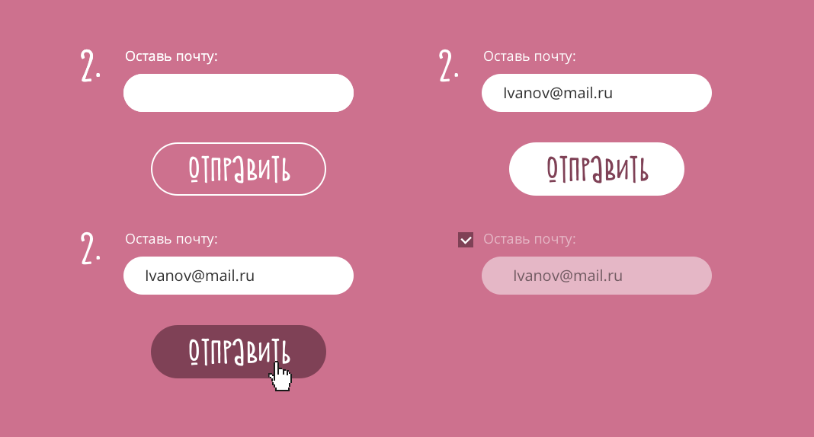

## Тестовое задание Aviasales Marketing ([full-stack](https://aviasales.recruitee.com/o/fullstack-developer))

Нужно реализовать блок из нашей маркетинговой кампании ([ссылка на фигму](https://i.avs.io/ramnx0)).

**Условий несколько:**
- Используйте TypeScript, React
- Любой state management (Redux, Effector, StateX, etc)
- NodeJS/PostgreSQL для серверной части.

**Будет плюсом если:**
- Сделаете деплой или просто пришлете инструкцию по запуску

## Задачи
### Блок с формой подписки (#task1)
При вводе валидной почты кнопка становится активной. 

- Если почта не валидна, то кнопка неактивна и появляется текст "Неверный формат почты".
- После отправки на сервер весь блок становится неактивным. 
- В случае ошибки на сервере, блок должен вернуться в исходное состояние. 
- Если почта уже зарегистрирована, то блок должен показать ошибку. 

### Блок с кнопками шаринга (#task2)
При клике на кнопку должно открываться шеринг страницы сот сети сеть, т.е используются share ссылки соц сетей.
- Если пользователь поделился страницей, то кнопка должна становится неактивной.
- Если пользователь кликнул на кнопку "Я поделился", но он не кликакл на кнопку шаринга, то блок должен показать ошибку.

### Сохранение информации о пользователе в БД (#task3)
При клике на шеринг в соц сетях на сервер отправляется запрос на создание пользователя: `{ email: string }`. 
- Если почта валидна, то в ответ присылается идентификатор пользователя и сохраняется в localStorage и мы переходим на финальный экран

### Финальный экран (#task4)
После расшаривания и заполнения формы с эл. почтой нужно показать пользователю финальный экран.

## Удачи, если будут какие-то вопросы, то пишите, добавим уточнения в репу.

### [Пример реализации](https://indriver.aviasales.ru)
